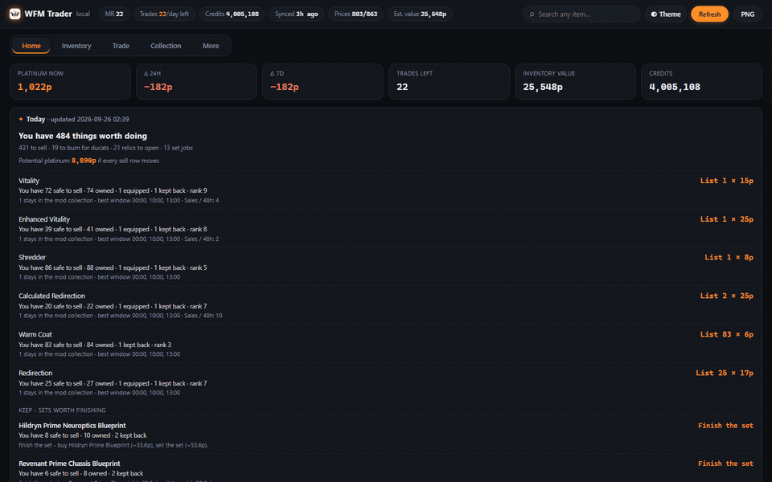
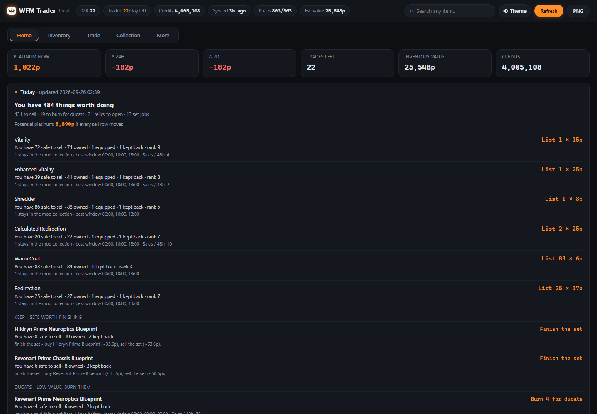
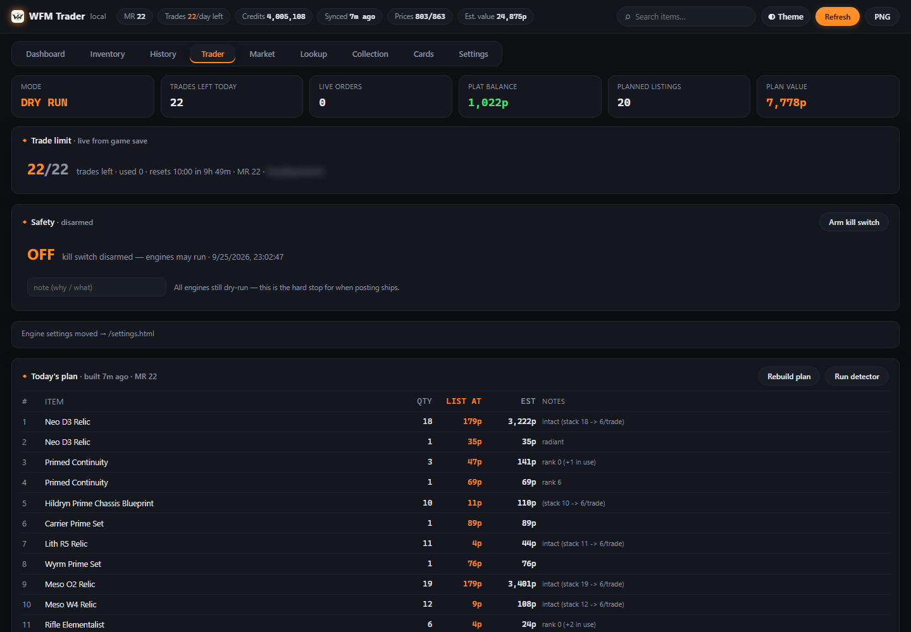
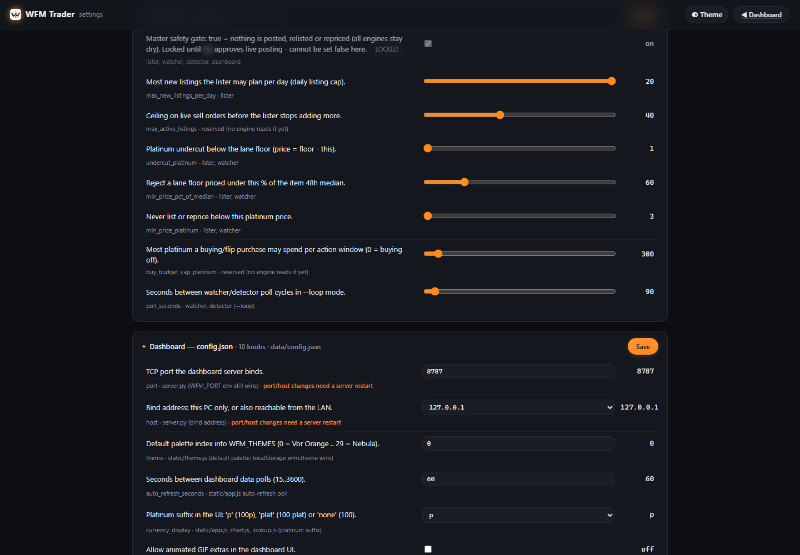
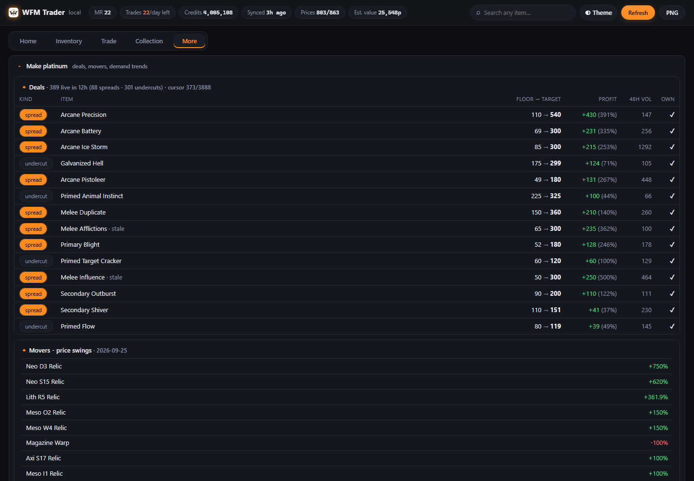
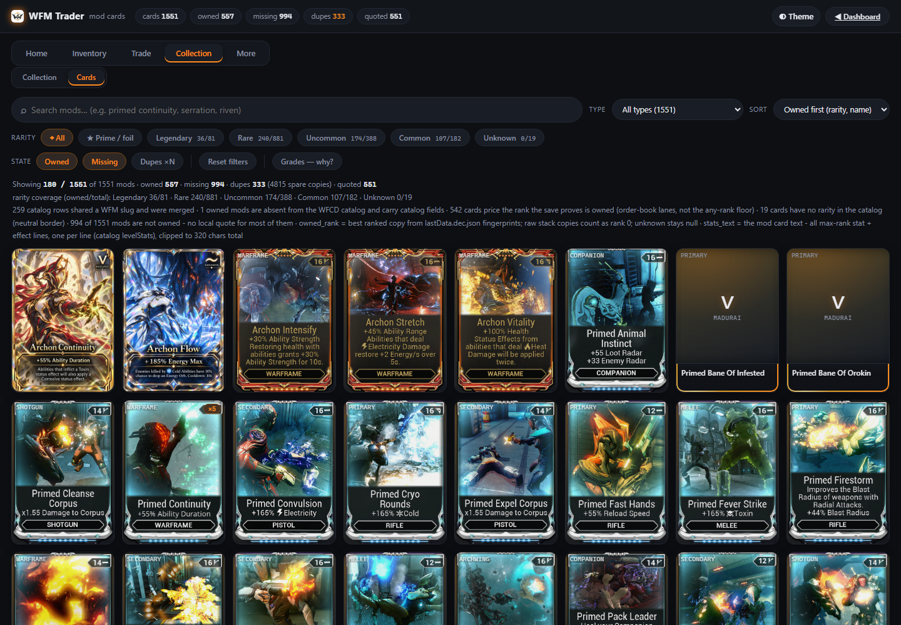

# WFM Trader



A local, single-user dashboard for **your own Warframe inventory** and **warframe.market** prices,
plus a **dry-run-first trader toolkit** that plans listings, watches undercuts and keeps its own
trade log. Everything runs on your own PC: a Python 3.11 standard-library server on
`127.0.0.1:8787`, a vanilla-JS front end (no framework, no build step) and JSON files under `data/`.
No account is needed to start, and nothing is uploaded anywhere.

*(The preview flips the palette once mid-tour — 30 themes ship, this is one of them switching.)*

## Safety: dry run is the default and the only shipped mode

- **`dry_run` is locked on.** It is the master safety gate, and the settings writer refuses to set it
  false: `python scripts/trader/settings.py --set dry_run=false` exits `3` and leaves the file
  byte-identical. Every trader engine therefore plans and checks — none of them posts, relists or
  reprices.
- **Kill switch.** Arm it from the Trader tab (`data/kill_switch.json`); the engines check it before
  every cycle, which makes it the hard stop for the day the live posting path lands.
- **Guardrails, not constants.** Daily listing cap, ceiling on live sell orders, price floor, floor
  as a % of the 48h median, undercut size, buy budget and poll interval are validated settings with
  atomic writes — see [Configuration](#configuration).
- **It says what it is.** Requests go to AlecaFrame's local cache and the public warframe.market API
  as `WFMTrader/0.1 (local personal tool; github.com/JAYST3AM/wfm-dashboard)` — it does not pretend
  to be a browser.

Honest status: the dashboard, inventory sync, trade log, market scanners, lookup, collection and
cards pages are in daily use. The trader stack (plan → detector → undercut watch → hygiene → run
queue) runs dry run only. `auto.py`, the supervised orchestrator, is v0: one cycle at a time, dry
run. Live posting is not in this repository.

## Install

```bash
pip install cryptography   # only for the inventory side: it decrypts AlecaFrame's local cache
python scripts/setup.py    # first run: read AlecaFrame, build the inventory, fetch prices (~20-30 min)
start.bat                  # or: python server.py
```

Open **http://127.0.0.1:8787**

The server, the UI and the market scripts are stdlib-only Python 3.11+. `cryptography` is the one
package, and only AlecaFrame's save needs it. `stop.bat` kills the process on port 8787.

Optional: copy `secrets.example.json` → `secrets.json` and run `python scripts/wfm_check.py` to sign
in once and confirm your warframe.market session (needed only by the order-touching scripts).
Schedule `scripts/snapshot_plat.py` every 15 minutes if you want the platinum chart to keep building
history continuously, and `scripts/watch_save.py` if you want the inventory to re-sync itself when
AlecaFrame rewrites the game save.

## Pages

Screenshots below show a real account with the account handle blurred.

### Dashboard — `/`

KPI tiles (platinum now with 24h/7d deltas, trades left, inventory value, credits), the platinum
chart, **top sell picks** ranked by earnings × how fast they sell, and the game-updates feed.



### Trader — `/#trader`

Trade limit straight from the game save, the **Safety** kill switch, today's plan, held-back rows,
the detector's sale feed, undercut watch, the run queue (buyers worth running to first) and the
flipper's buy plan. Every action button runs its engine and shows the raw output.



### Settings — `/settings.html`

The guardrail knobs (master gate shown **LOCKED** and on, caps, floors, poll interval) plus the
dashboard's own `config.json` knobs, both validated by their engine before anything is written.



### Market — `/#market`

Deals (spreads and undercuts live in the last 12h), flips ranked by margin × liquidity, near-complete
nudges, ducats (sell vs burn), craft (build vs buy), wishlist budget planner, watchlist bands, set
targets, relic EV, movers, riven bands, Baro, demand trends and post-patch meta.



### Inventory · History · Lookup · Collection · Cards

**Inventory** is every tradeable you own, searchable, with live prices and total value, plus the
inventory-change list. **History** is your own trade log — warframe.market has no public
trade-history API, so the dashboard keeps the record itself as you trade — with session stats, sell
timing and the platinum ledger (what the log explains vs what the game took out). **Lookup**
(`/lookup.html`) is a searchable item browser with zoomable images. **Collection**
(`/collection.html`) is "what has this account collected vs everything obtainable", with per-category
progress. **Cards** (`/cards.html`) renders every mod as a trading card — owned, missing, dupes and
quotes.



## Engines

Each engine is a script you can also run by hand; the dashboard buttons call the same files.

**Core data — `scripts/`**

- `setup.py` — first run: connects everything in order and builds the dashboard's data.
- `refresh.py` — refresh pipeline: decrypt the AlecaFrame save → `owned.json`.
- `fetch_prices.py` — live top price for every owned sellable slug → `prices.json` (resumable).
- `fetch_stats.py` — warframe.market item statistics (liquidity + price quality) for owned slugs.
- `fetch_lanes.py` — the full order book per owned ranked mod, reduced to **rank lanes** →
  `price_lanes.json`. An item-level "sell 15p / buy 55p" pair is usually a rank-0 listing next
  to a rank-10 bid — neither prices the copy you hold. Each lane stores the cheapest sell
  order (`ask` — undercut it by 1p to list) and the top buy order (`bid` — quick-sell price,
  or outbid it by 1p to buy) for that rank, and the UI reads the lane of the rank the save
  proves you own (resumable, same rate discipline as the other fetchers).
- `snapshot_plat.py` — snapshots platinum and credits into `plat_history.json`.
- `watch_save.py` — re-runs the refresh pipeline when AlecaFrame rewrites the game save.
- `invdiff.py` — inventory change tracker: snapshot, then diff against the last one.
- `price_history.py` — per-item price history logger + 24h movers (offline, stdlib only).
- `import_aleca_stats.py` — imports an AlecaFrame stats export into the dashboard's own history.
- `log_trade.py` — appends an event to `data/trade_log.json`.
- `report.py` — liquidity + margin research over the owned inventory.
- `backup.py` — backup + export of the dashboard's data.
- `profiles.py` — one data profile per Warframe account (multi-account isolation).
- `wfm_check.py` — verifies the warframe.market login and prints your live orders.

**Trader — `scripts/trader/`** (the local trader stack; it is not published with this repository, and
it is dry run)

- `lister.py` — builds today's listing plan from the report + live account state.
- `detector.py` — completed sales from order, platinum and inventory diffs.
- `watcher.py` — undercut watch: live sell orders against the current lane floors.
- `limits.py` — today's trade allowance and the next daily reset, from the game save.
- `inuse.py` — equipped-copy detection: never sells a mod/arcane copy that is slotted in a build.
- `killswitch.py` — kill switch + preflight gate for the engines.
- `hygiene.py` — listing hygiene: order-visibility actions for your own listings.
- `flipper.py` — capped buy plan from the ranked flip lanes.
- `runqueue.py` — the buyers worth running to first, per listing.
- `riven_lister.py` — veiled-riven orders + manual-price holds.
- `notify_rules.py` — the trader-side gate in front of `scripts/notify.py`.
- `settings.py` — the single read / validate / atomic-write path for the guardrail knobs.
- `auto.py` — supervised single cycle over the engines (v0, dry run).
- `wfm_session.py` — warframe.market session helper (signs in from `secrets.json`).

**Market research — `scripts/`**

- `deal_scanner.py` — market-wide deal scanner for warframe.market.
- `flip_digest.py` — deal rows ranked by margin × liquidity for a repeatable trade plan.
- `nudges.py` — nearly-finished sets: finish it or cash it?
- `craft.py` — build it, or just buy it?
- `sets.py` — prime-set completion analyzer.
- `relic_ev.py` — expected platinum from opening a relic vs selling it as-is.
- `ducats.py` — sell a prime part for platinum, or burn it into ducats?
- `rivens.py` — veiled-riven price bands + owned-riven valuation.
- `wishlist.py` — wishlist + budget planner.
- `watchlist.py` — "tell me when this item is cheap / expensive" alert feed.
- `baro.py` — Baro Ki'Teer planner for the current or next visit.
- `trends.py` — demand-trend badges (30-day volume vs the 90-day baseline).
- `meta_watcher.py` — post-patch demand spikes and sinks.
- `sell_timing.py` — which local hours this account actually sells in.
- `session_stats.py` — trading-session analytics from local history.
- `plat_ledger.py` — what the trade log explains, and what the game itself took out.
- `sell_advisor.py` — the smart sell layer: one recommendation per owned item, composed from every
  other data file ("what should I actually do with this item right now?"). Never counts equipped
  copies, keeps one copy for the collection and reserves parts for sets/crafts, then explains the
  call — floor, demand, price trend, your own sale hours, Baro/ducat/relic context.

**Collection — `scripts/`**

- `collection_log.py` — "what has this account collected vs everything obtainable".
- `mod_cards.py` — every Warframe mod as a trading card, with owned/missing/dupe state.

**Alerts and ops — `scripts/`**

- `notify.py` — one local outbox, then optional webhook delivery.
- `pushd.py` — grouped digest of whatever is new since the last run.
- `digest.py` — one Discord-ready daily message composed from the data files.
- `tray.py` — system-tray widget for the dashboard (stdlib + ctypes).
- `cli.py` — read-only terminal interface to the dashboard's data.
- `config.py` — the dashboard-side knobs in `data/config.json`.

## Configuration

Both files are validated before anything is written, and every write is atomic — a refused value
changes nothing. The Settings page writes both; the CLI does the same thing.

- `data/config.json` — dashboard knobs: `port` (8787), `host` (127.0.0.1), `theme` (0–29),
  `auto_refresh_seconds` (60), `currency_display`, `gifs`, `gamenews_cache_seconds`, `deals_shown`,
  `sessions_shown`, `watch_save_seconds`. `python scripts/config.py --show` prints the effective
  values, `--set theme=17` writes one.
- `scripts/trader/settings.json` — the trader guardrails: `dry_run` (locked on),
  `max_new_listings_per_day` (20), `max_active_listings` (40), `undercut_platinum` (1),
  `min_price_pct_of_median` (60), `min_price_platinum` (3), `buy_budget_cap_platinum` (300),
  `poll_seconds` (90). `python scripts/trader/settings.py --schema` lists them with their ranges and
  which engine consumes each one.

## Tests

```bash
python -m pytest tests -q     # the full public suite, green on Python 3.11 in this checkout
```

The suite is public and self-contained: every test builds its own fixtures in `tmp_path`, so it
passes on a clean checkout with no `data/` directory and without the private trader engines. CI runs
it on Python 3.11 (`.github/workflows/tests.yml`).

## Repo layout

- `server.py` — the whole HTTP server (stdlib): pages, `/api/*` payloads, refresh buttons, trader
  actions.
- `static/` — the UI: `index.html` + `lookup.html`, `collection.html`, `cards.html`, `settings.html`,
  one `app.js`, one `style.css`, one `theme.js` (30 palettes), one `chart.js`.
- `scripts/` — the engines above; `tests/` — the public suite; `data/` — everything the app writes
  (gitignored); `secrets.json` — your warframe.market login (gitignored).
- `tools/make_preview.py` — rebuilds `assets/preview.gif` and the page screenshots from a running
  dashboard (headless Chrome via puppeteer-core; ffmpeg or Pillow for the assembly). Offline checks:
  `python tools/make_preview.py --selftest`.

## Notes

- Personal, local tool. Not affiliated with Digital Extremes, AlecaFrame/Overwolf or
  warframe.market.
- It reads two things: AlecaFrame's local cache (the inventory side is Windows-only because
  AlecaFrame is) and public warframe.market endpoints for prices, statistics and — only if you
  connect an account — your own orders. It identifies itself honestly and never disguises itself as
  a browser. You are responsible for how you use it against warframe.market's rules.
- Nothing is posted on your behalf: the trader engines are dry run.

## Roadmap

- harden `auto.py` (v0) so a supervised dry-run cycle can run on a timer, and fold the digest/push
  delivery into that loop.
- deepen the price-history-driven scanners (sell timing, movers, trends).
- the live posting path stays out until it can land behind the locked `dry_run` gate, the kill switch
  and the caps above.

MIT licensed.
