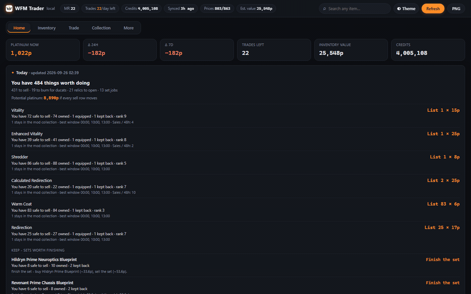

# WFM Trader



A local, single-user dashboard for **your own Warframe inventory** and **warframe.market** prices,
plus a plan-first trader toolkit that plans listings, watches undercuts and keeps its own trade log.
Everything runs on your own PC: a Python 3.11 standard-library server on `127.0.0.1:8787`, a
vanilla-JS front end (no framework, no build step) and JSON files under `data/`.

**Zero AI.** No API key, no model call, no account, no telemetry. Every number is computed by local
Python over data you already have (AlecaFrame's save + public market endpoints). See
[What runs with what](#what-runs-with-what).

> **Screenshot: add yours.** The images in `assets/` were captured before the 2026-09-28 navigation
> restructure, so the rail in them is the old one (and `shot_market.png` shows the retired More
> page). The content is real; the nav is not current. `python tools/make_preview.py` rebuilds them
> from a running dashboard — it still targets the old `#more` hash, so it needs the new-nav pass
> before it can be trusted again.

## What runs with what

| Works immediately — no keys, no AI, no account | Needs this on your PC | Optional, only for extras |
|---|---|---|
| The whole UI: rail, Home, Trade, Inventory, Collection, Tools, Settings, the 60 themes, global search, the item drawer | **Warframe** (Windows) + [AlecaFrame](https://alecaframe.com) installed and synced once — it is where the inventory comes from | A warframe.market session in `secrets.json` — only the order-touching scripts use it |
| Everything computed from `data/` once built: prices, rank lanes, sell advice, collection, relics, mastery, cards | `pip install cryptography` — it decrypts AlecaFrame's local cache (the inventory side is Windows-only because AlecaFrame is) | A shared chat relay (`chat-relay/`, one Cloudflare Worker, free tier) if you want Home's chat dock to be more than a local log |
| The trader *plans*: listing plan, undercut watch, hygiene plan, flip plan, the guardrail settings | A first data build: `python scripts/setup.py` (~20–40 minutes, resumable) | `scripts/snapshot_plat.py` every 15 min and `scripts/watch_save.py` for continuous history / self-syncing inventory |

Prices, statistics and order books come from public warframe.market endpoints. Requests identify
themselves as `WFMTrader/0.1 (local personal tool; github.com/JAYST3AM/wfm-dashboard)` — it never
pretends to be a browser.

## How you get around it

The rail is the same on every page, rendered from one shared source (`static/shell.js` + `shell.css`):

| Pill | Goes to | What is there |
|---|---|---|
| **Home** | `/#home` | Four questions and nothing else: **what to sell next, for how much, who is buying it, and what you earned today.** The Today strip (platinum, sales, trades left) with detail one tap below; alerts; the sell queue; recent activity. Game news moved to Tools. |
| **Trade** | `/#trade` | **Sell** — today's recommended listings, held-back rows ("not recommended right now"), listings needing attention (undercut + stale), the trade limit from the game save. **Buy** — flip opportunities (margin × liquidity) and the wishlist budget planner. **History** — your own trade log (warframe.market has no public trade-history API, so the dashboard keeps the record), sessions, sell timing, the platinum ledger. Below the tabs: the run queue, the **Safety** kill switch and notifications. |
| **Inventory** | `/#inventory` | Every tradeable you own, filtered by category or typed. Default columns stay simple (item, qty, equipped, safe to sell, sell price, value); **All columns** adds category, ducats, buyer offering, profit gap, sales / 48h, typical price, reserved. Materials and Clan Dojo panels, and the inventory-change log. |
| **Collection** | `/collection.html` | Four sections: **Collection** (collected vs obtainable, per-category progress, how to get each item) · **Relics** (every relic: drops, reward table per refinement, EV, your copies) · **Mastery** (rank gap + the ranked do-this-next queue) · **Cards** (`/cards.html`, every mod as a trading card with full-art faces and a 3D inspect). |
| **Planner** | `/planner.html` | The **build planner**: pick any Warframe/weapon, edit a build like the Arsenal (slots, ranks, polarities, Catalyst/Reactor, Exilus, Forma) across configs A/B/C, and read what the Phase 1 engine says it produces — stats with before/after, the damage split and combined elements, the capacity breakdown, the trace behind every number, and every mechanic it refuses to fake. Deep-linkable (`?equip=Braton Prime&config=B`). |
| **Tools** | `/#tools` | A launcher — one focused workspace at a time (table below). Was the old More page. |
| **Settings** | `/settings.html` | One category at a time: General / Trading / Appearance / Accounts / Notifications / Advanced. Deep-link any of them (`/settings.html#trading`). |

Tools, one workspace visible at a time (`#tools/<slug>`):

| Group | Workspaces | Slugs |
|---|---|---|
| Trading | Deals · Movers & demand · Riven bands · Watchlist | `#tools/deals`, `#tools/trends`, `#tools/rivens`, `#tools/wl` |
| Planning | Ducats · Craft or buy · Relic EV · Sets | `#tools/ducats`, `#tools/craft`, `#tools/relicev`, `#tools/sets` |
| Warframe | Baro Ki'Teer · Patch meta · Game news · Player profile | `#tools/baro`, `#tools/meta`, `#tools/news`, `#tools/player` |

Details worth knowing:

- **Two item surfaces, on purpose.** The shared **drawer** (the header search, any inventory row,
  any collection tile) is the quick look, with exactly one primary action — **Open full analysis ↗**
  → `/item.html?item=<slug>` — the deep page with the chart, trades, order book and statistics.
- **Rank-aware pricing.** The full order book per owned ranked mod is reduced to rank lanes, so the
  UI prices the rank your save proves you own — never a rank-0 listing next to a rank-10 bid.
- **Old links still resolve** (nothing lands blank): `#more` / `#market` → `#tools`,
  `#player` → `#tools/player`, `#mastery` → `/collection.html#mastery`,
  `#history` / `#trader` → `#trade`, `/lookup.html` → the header search.

## Quick start

**Windows, no Python — the one-click app.** Grab **`WFM-Trader-<date>.zip`** from the
[Releases page](../../releases), unzip it anywhere and double-click **`WFM Trader.exe`**. It brings
its own Python: it checks AlecaFrame, builds your data on the first run (20–40 minutes, resumable),
starts the dashboard and opens the browser. `START HERE.txt` in the zip says the same. To build the
zip yourself: `python tools/build_app.py --bundle`.

**Windows, from source — the one-click script.** Double-click **`setup.bat`** once. It finds Python,
installs the one dependency, checks AlecaFrame, builds the data (20–40 minutes the first time —
resumable, stop it any time) and opens the dashboard. Later, **`refresh.bat`** re-prices everything
in a few minutes.

Manual / any platform:

```bash
pip install cryptography   # only for the inventory side: it decrypts AlecaFrame's local cache
python scripts/setup.py    # first run: read AlecaFrame, build ALL the data (~20-40 min, resumable)
python server.py           # or start.bat on Windows
```

Open **http://127.0.0.1:8787** — the port is `data/config.json` → `port` (env `WFM_PORT` wins).
`stop.bat` kills whatever is listening on 8787.

**What you need first:** Warframe on this PC + AlecaFrame installed and synced once (open the game
after installing it). `setup.py` tells you exactly what to do if the AlecaFrame cache is not found
yet. The server, the UI and the market scripts are stdlib-only Python 3.11+ (3.14 works);
`cryptography` is the one package, and only AlecaFrame's save needs it.

### Keeping it running / fresh

- `refresh.bat` — re-fetch prices/stats/rank lanes and rebuild the derived data (a couple of
  minutes, resumable). The dashboard's **Refresh** button reloads the page's own data only.
- `supervise.bat` — keeps the server alive: starts it, restarts it if it exits, restarts it when the
  health check fails. If something already serves the port it just watches. Put a shortcut in your
  Startup folder (Win+R → `shell:startup`) to have the dashboard up on every login. Offline check:
  `python tools/supervise.py --selftest`.
- Schedule `scripts/snapshot_plat.py` every 15 minutes if you want the platinum chart to keep
  building history continuously, and `scripts/watch_save.py` if you want the inventory to re-sync
  itself when AlecaFrame rewrites the game save.
- **Multiple Warframe accounts:** Settings → **Accounts** keeps one data profile per account and
  switches the live data between them — it shows the switch plan first, takes a safety zip, and
  never deletes anything. Same engine on the CLI:
  `python scripts/profiles.py --list | --create [NAME] | --switch NAME [--apply]`.

### Signing in (optional — and the verification step is yours)

Nothing needs a warframe.market login except the order-touching scripts; the dashboard is fully
useful without one. To connect an account: copy `secrets.example.json` → `secrets.json`, then run
`python scripts/wfm_check.py` to sign in once and confirm the session.

If warframe.market shows a Cloudflare browser check or wants a one-time code, that part is yours to
complete (AlecaFrame tells its users the same thing). The app never asks for, fetches, stores or
logs a code, and it stops with instructions instead of guessing. The quickest way past it: sign in
once in your own browser and hand the app that session — `secrets.json` → `"wfm_token"` = the `JWT`
cookie from F12 → Application → Cookies → warframe.market. It then uses your browser session and
never needs the password sign-in.

## Safety: posting is Not live, and that is the only shipped mode

The stack these gates protect (`scripts/trader/`) is the private half — **not published with this
repository**. A public checkout gets the dashboard, the public scripts and this safety model; when
the stack is present, this is how it behaves.

| Gate | What it does |
|---|---|
| **`dry_run` — locked on** | The master gate. The settings writer refuses to turn it off: `python scripts/trader/settings.py --set dry_run=false` exits `3` and leaves the file byte-identical. Every trader engine therefore plans and checks — none of them posts, relists or reprices. `scripts/trader/auto.py` refuses all engine work unless `dry_run` is true, whatever else the file says. |
| **Kill switch** | Armed from Trade → Safety (state in `data/kill_switch.json`). The engines check it before every cycle — the hard stop for the day a live posting path lands. `profiles.py` deliberately never copies it into another account's profile. |
| **Guardrails, not constants** | Validated settings with atomic writes and a schema (`python scripts/trader/settings.py --schema`): `max_new_listings_per_day` **20**, `max_active_listings` **40**, `undercut_platinum` **1** (list 1p under the cheapest ask), `min_price_pct_of_median` **60** (never below 60% of the 48h median), `min_price_platinum` **3**, `buy_budget_cap_platinum` **300**, `poll_seconds` **90**. |
| **Nothing posts automatically** | No engine has a live posting path: the lister *plans* rows, the watcher *reports* undercuts, hygiene *plans* visibility actions and executes nothing. Using any of it is explicit and local — the live posting path is not in this repository. |
| **It says what it is** | Requests go to AlecaFrame's local cache and public warframe.market endpoints under a self-describing user agent (above) — never disguised as a browser. |

Honest status: the dashboard, inventory sync, trade log, market scanners, search, collection,
relics, mastery, cards and the Tools workspaces are in daily use. The trader stack
(plan → detector → undercut watch → hygiene → run queue) is **Not live**: `auto.py`, the supervised
orchestrator, is v0 — one supervised cycle at a time.

## Privacy: what stays on this PC

| Stays local | Detail |
|---|---|
| Your game data | Everything the app writes lives in `data/` (gitignored), plus the derived files under `static/` that carry account state (`collection_log.json`, `relics_panel.json`, `mastery.json`, `progress.json`, `colimg/`) — also gitignored, because they are personal progress. |
| Your login | `secrets.json` is gitignored; `secrets.example.json` is the only committed shape. Nothing in the app logs, prints or uploads the token or password. |
| Your inventory | Read from a local decrypt of AlecaFrame's cache. Never uploaded. |
| Your trade log, chat, settings | Local JSON under `data/`. |

| Leaves the PC | Detail |
|---|---|
| Price / statistics / order-book reads | Public GETs to warframe.market (no account needed). Public drop tables and the wiki for relic/mastery/collection data. |
| Chat messages | **Only if you set `chat_relay_url`.** Then Home's chat dock posts plain text to *that* room, stamped with the name and rank from your local save. There is no default relay — left empty, the chat stays on this PC (`data/chat.json`). Rooms are open to anyone with the URL; don't post anything private. |

## Configuration

Both files are validated before anything is written, and every write is atomic — a refused value
changes nothing. The Settings page and the CLI do the same thing.

- `data/config.json` — the dashboard knobs: `port` (8787), `host` (127.0.0.1), `theme` (0–29 — the
  default palette; the in-UI picker covers all 60 and is remembered per browser),
  `auto_refresh_seconds` (900), `currency_display` (`p`), `gifs`, `gamenews_cache_seconds` (1800),
  `deals_shown` (60), `sessions_shown` (12), `watch_save_seconds` (20), `chat_relay_url` (empty).
  `python scripts/config.py --show` prints the effective values, `--set theme=17` writes one.
- `scripts/trader/settings.json` — the trader guardrails: `dry_run` (the Live/Not-live gate, locked to Not live), `max_new_listings_per_day` (20), `max_active_listings` (40),
  `undercut_platinum` (1), `min_price_pct_of_median` (60), `min_price_platinum` (3),
  `buy_budget_cap_platinum` (300), `poll_seconds` (90). `python scripts/trader/settings.py --schema`
  lists them with their ranges and which engine consumes each one. A `dry_run=false` write is
  refused (exit 3, file byte-identical).

## Tests

```bash
python -m pytest tests -q     # the full public suite, green on Python 3.11 in this checkout
```

The suite is public and self-contained: every test builds its own fixtures in `tmp_path`, so it
passes on a clean checkout with no `data/` directory and without the private trader engines. CI runs
it on Python 3.11 (`.github/workflows/tests.yml`).

## Where the code lives

| Path | What |
|---|---|
| `server.py` | The whole HTTP server (stdlib): pages, `/api/*` payloads, refresh buttons, trader actions. |
| `static/shell.js` + `static/shell.css` | **The one source of the app chrome** — header, rail, theme panel, sync state — shared by `index`, `collection`, `cards`, `planner`, `settings` and `item`. A page declares `<body data-shell="…" data-shell-actions="…">` and keeps only its content, its sub-nav and its footer; adding a destination means editing the rail registry in `shell.js`, not five pages. `tests/test_app_shell.py` fails if a page re-declares chrome. |
| `static/` | The UI: `index.html` (Home / Trade / Inventory / Tools), `collection.*`, `cards.*`, `planner.*` (the build planner page: `planner.js` state + slots + drag/drop, `planner-library.js` the mod browser, `planner-stats.js` the stat/trace/element/capacity panels, `planner.css`), `settings.*`, `item.*` (the full analysis page, `/item.html?item=<slug>`), the shared drawer (`drawer.js` / `drawer.css`), `home.js` / `home.css`, `app.js`, `style.css`, `theme.js` (60 palettes), `chart.js`, `chat.js`, `export.js` (dormant: the header's PNG button it served was removed 2026-09-29 - it drew a stale, price-less report), `icons.js` + the vendored Phosphor sprite, `lookup.html` (search redirect stub) and `lookup_items.json` (the offline item catalogue the drawer falls back to). No framework, no build step. |
| `scripts/` | The engines (below): data fetchers, the sell/trade analysis, collection and alerting. `scripts/orders.py` reads one item's live warframe.market order book (45 s cache) for Trade → Orders; `scripts/whisper.py` builds the site's generated whisper line and, on Windows, copies it and types Ctrl+V + Enter into the game — **one click, one message**, 2 s apart, 10 a minute, and it says 'game window not found' rather than typing blind. `scripts/trader/` is the private stack — **not published with this repository**. |
| `tools/` | `build_app.py` (freezes the one-click exe + release zip), `wfm_app.py` (the exe's entry point), `build_icons.py`, `gen_themes.py`, `make_preview.py` (the README preview assets), `supervise.py` (the keep-alive). |
| `builds/` | The build-planner engine (static-cap math): `ingest.py` turns WFCD + the market item list into `data/build_data.json`, and the engines (`weapons`, `warframes`, `capacity`, `elements`, `effects`) answer "what does this build produce, and why?" with a trace on every stat. `builds/debug.py` is its developer surface; `server.py` joins it to the planner page under `/api/planner/*` (the page owns no math). See [`docs/build-planner.md`](docs/build-planner.md). |
| `tests/` | The public suite. |
| `data/` | Everything the app writes (gitignored) — and `secrets.json` lives beside it at the root (gitignored too). |
| `chat-relay/` | Optional Cloudflare Worker + Durable Object for a shared chat room. Not needed by the app. |
| `design/` · `docs/` | `design/migration-map.md` (the IA map + stage history), the audit output in `design/_audit/`, and `docs/navigation.md` (the navigation contract). |
| `*.bat` | `setup.bat` one-time install · `refresh.bat` quick re-price · `supervise.bat` keep-alive · `start.bat` / `stop.bat`. |

The icons are [Phosphor](https://phosphoricons.com) (MIT), vendored into `static/icons/` as one
self-hosted sprite — no CDN, no build step; `tools/build_icons.py --check` keeps them resolving.

## Engines

Each engine is a script you can also run by hand; the dashboard buttons call the same files.

**Core data — `scripts/`**

- `setup.py` — first run: connects everything in order and builds the dashboard's data.
- `refresh.py` — refresh pipeline: decrypt the AlecaFrame save → `owned.json`.
- `fetch_prices.py` — live top price for every owned sellable slug → `prices.json` (resumable).
- `fetch_stats.py` — warframe.market item statistics (liquidity + price quality) for owned slugs.
- `fetch_lanes.py` — the full order book per owned ranked mod, reduced to **rank lanes** →
  `price_lanes.json`. Each lane stores the cheapest sell order (`ask` — undercut it by 1p to list)
  and the top buy order (`bid` — quick-sell price, or outbid it by 1p to buy) for that rank, and the
  UI reads the lane of the rank the save proves you own (resumable, same rate discipline as the
  other fetchers).
- `snapshot_plat.py` — snapshots platinum and credits into `plat_history.json`.
- `watch_save.py` — re-runs the refresh pipeline when AlecaFrame rewrites the game save.
- `invdiff.py` — inventory change tracker: snapshot, then diff against the last one.
- `price_history.py` — per-item daily price history logger + 24h movers (offline, stdlib only).
- `item_history.py` — the intraday series behind the sparklines and the item page → `item_history.json`.
- `import_aleca_stats.py` — imports an AlecaFrame stats export into the dashboard's own history.
- `materials.py` — materials/resources store from the save → `materials.json`.
- `dojo_costs.py` — Clan Dojo material costs, transcribed from the wiki's room tables.
- `player.py` — player profile store (mastery, syndicates, intrinsics, focus) → `player.json`.
- `log_trade.py` — appends an event to `data/trade_log.json`.
- `report.py` — liquidity + margin research over the owned inventory.
- `backup.py` — backup + export of the dashboard's data.
- `profiles.py` — one data profile per Warframe account (multi-account isolation).
- `wfm_check.py` — verifies the warframe.market login and prints your live orders.

**Trader — `scripts/trader/`** (the local trader stack; it is not published with this repository, and
it is Not live)

- `lister.py` — builds today's listing plan from the report + live account state.
- `detector.py` — completed sales from order, platinum and inventory diffs.
- `watcher.py` — undercut watch: live sell orders against the current lane floors.
- `limits.py` — today's trade allowance and the next daily reset, from the game save.
- `inuse.py` — equipped-copy detection: never sells a mod/arcane copy that is slotted in a build.
- `killswitch.py` — kill switch + preflight gate for the engines.
- `hygiene.py` — listing hygiene: plans order-visibility actions for your own listings (executes nothing).
- `flipper.py` — capped buy plan from the ranked flip lanes.
- `runqueue.py` — the buyers worth running to first, per listing.
- `riven_lister.py` — veiled-riven orders + manual-price holds.
- `notify_rules.py` — the trader-side gate in front of `scripts/notify.py`.
- `settings.py` — the single read / validate / atomic-write path for the guardrail knobs.
- `auto.py` — supervised single cycle over the engines (v0, Not live).
- `wfm_session.py` — warframe.market session helper (signs in from `secrets.json`).

**Market research — `scripts/`**

- `deal_scanner.py` — market-wide deal scanner for warframe.market.
- `flip_digest.py` — deal rows ranked by margin × liquidity for a repeatable trade plan.
- `nudges.py` — nearly-finished sets: finish it or cash it?
- `craft.py` — build it, or just buy it?
- `sets.py` — prime-set completion analyzer.
- `relic_ev.py` — expected platinum from opening a relic vs selling it as-is.
- `ducats.py` — sell a prime part for platinum, or burn it into ducats?
- `relics_panel.py` — every relic: drop locations, reward tables per refinement, ownership, EV.
- `mastery.py` — the mastery helper: rank gap + what to master next (XP values from the wiki).
- `progress.py` — today / sessions tracker: platinum, credits, trades, items, materials.
- `rivens.py` — veiled-riven price bands + owned-riven valuation.
- `wishlist.py` — wishlist + budget planner.
- `watchlist.py` — "tell me when this item is cheap / expensive" alert feed.
- `baro.py` — Baro Ki'Teer planner for the current or next visit.
- `trends.py` — demand-trend badges (30-day volume vs the 90-day baseline).
- `meta_watcher.py` — post-patch demand spikes and sinks.
- `sell_timing.py` — which local hours this account actually sells in.
- `session_stats.py` — trading-session analytics from local history.
- `plat_ledger.py` — what the trade log explains, and what the game itself took out.
- `sell_advisor.py` — the smart sell layer: one recommendation per owned item, composed from every
  other data file ("what should I actually do with this item right now?"). Never counts equipped
  copies, keeps one copy for the collection and reserves parts for sets/crafts, then explains the
  call — floor, demand, price trend, your own sale hours, Baro/ducat/relic context.

**Collection — `scripts/`**

- `collection_log.py` — "what has this account collected vs everything obtainable".
- `obtain_index.py` — "how do I get this item?", built from public drop tables (cached offline).
- `mod_cards.py` — every Warframe mod as a trading card, with owned/missing/dupe state.
- `icon_cache.py` — caches the collection icons on this PC, so the page needs no CDN.

**Alerts and ops — `scripts/`**

- `notify.py` — one local outbox, then optional webhook delivery.
- `pushd.py` — grouped digest of whatever is new since the last run.
- `digest.py` — one Discord-ready daily message composed from the data files.
- `tray.py` — system-tray widget for the dashboard (stdlib + ctypes).
- `cli.py` — read-only terminal interface to the dashboard's data.
- `config.py` — the dashboard-side knobs in `data/config.json`.

## Notes

- Personal, local tool. Not affiliated with Digital Extremes, AlecaFrame/Overwolf or
  warframe.market.
- It reads two things: AlecaFrame's local cache (the inventory side is Windows-only because
  AlecaFrame is) and public warframe.market endpoints for prices, statistics and — only if you
  connect an account — your own orders. You are responsible for how you use it against
  warframe.market's rules.
- Nothing is posted on your behalf: the trader engines are Not live, `dry_run` is locked on.

## Roadmap

- harden `auto.py` (v0) so a supervised Not-live cycle can run on a timer, and fold the digest/push
  delivery into that loop.
- deepen the price-history-driven scanners (sell timing, movers, trends).
- the live posting path stays out until it can land behind the locked `dry_run` gate, the kill switch
  and the caps above.

MIT licensed.
